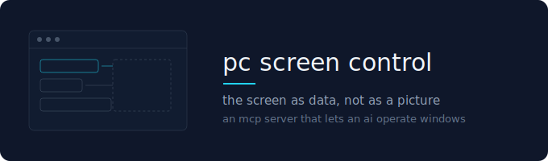
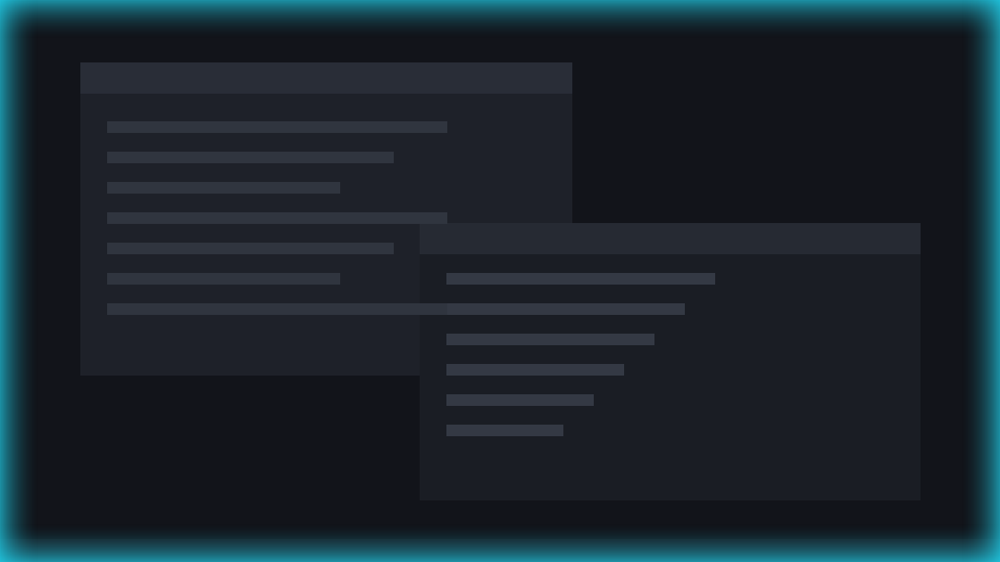

<p align="center">
  
</p>

<h3 align="center">A screenshot is a picture made for human eyes.<br>This hands your AI the screen as data instead.</h3>

<p align="center"><sub>An MCP server for Windows · one-click install for Claude Desktop · works with any MCP client</sub></p>

<p align="center">
  <a href="../../releases/latest"></a>
  <a href="docs/GUIDE.md"></a>
</p>

<p align="center">
  
  
  
  
  <a href="../../actions/workflows/ci.yml"></a>
</p>

---

## Install

This is a plain MCP server, so **any MCP client can use it** — Claude Desktop,
Claude Code, Cline, Continue, Zed, or something you wrote yourself. The
one-click `.mcpb` below is Claude Desktop's bundle format; for everything else
there is a four-line config at the bottom of this page.

Needs Windows and [Python 3.9+](https://www.python.org/downloads/) — tick **"Add
python.exe to PATH"** during its setup.

**1.** Download **[`pc-screen-control.mcpb`](../../releases/latest)**

**2.** In Claude: `Settings → Extensions → Advanced → Install extension…` and
pick the file

> **Do not double-click the file.** Windows has no handler for `.mcpb` and will
> ask you which program to open it with. There is no right answer to that.

**3.** Close Claude completely — tray icon included — and start it again

There is no fourth step and nothing to switch on. To check, ask Claude to run
`describe_screen`; you should get a list of your open windows.

<sub>**[Full guide →](docs/GUIDE.md)** · From source instead: download this
repository as a ZIP and run `scripts\INSTALL.bat` · Remove: *Settings →
Extensions*, or `scripts\UNINSTALL.bat`</sub>

---

## Why this is better than a screenshot

Ask an AI to click something and it normally photographs your screen, squints at
it, and guesses a coordinate — then has no way of knowing whether the click
landed.

Windows already publishes what is on screen as structured data: every button,
field and list with its name and its state. That is how screen readers work.
This server hands Claude the same thing.

```
with a screenshot:   "click at 847, 312"      guessing, and no way to check
with this:           invoke(ref of "Save")    by name, and it comes back proven
```

| | |
|---|---|
| **It presses the right thing** | Controls are found by name, not by pixel. Nothing drifts when a window moves or the resolution changes. |
| **It knows whether it worked** | Every action returns the element's state before and after. Success is shown, not assumed. |
| **Your mouse stays yours** | Most of it goes through the accessibility interface rather than the pointer, so you can keep working while it works. |

---

## The cost ladder

Start at the top, stop at the first rung that works.

| | | cost to you |
|---|---|---|
| **1** | `read_ui_tree` `find_elements` `read_text` `read_table` | nothing |
| **2** | `invoke` `set_text` `set_value` `toggle` `select` `window` | **your cursor is never touched** |
| **3** | `capture` | nothing, but tells you less |
| **4** | `click` `drag` `send_keys` | **takes your mouse or keyboard** |

Rungs 1–3 cover almost everything. A screenshot loop has no choice but to live
on rung 4, every single time.

**For a long job in one application, it can get out of your way entirely.**
`claim_window` moves that window just past the edge of every monitor. It keeps
running and stays fully operable by name — but you cannot see it, and you cannot
click into it, because Windows will not let the mouse pointer leave the
monitors. Measured on a two-monitor desk: monitors end at x=4920, the window
parks at x=5120, and `SetCursorPos(5170)` lands at 4919. `release_window` puts it
back to the pixel, and so does the exit handler — including after a crash, since
the position is written to disk before the window moves. A window you cannot
reach with the mouse is not a window anyone should be able to strand.

**And it will not type into a window, or a field, you moved to.** A keystroke
sent without a target goes wherever the keyboard focus happens to be, which is
fine until you click somewhere between one call and the next — then the Enter
meant for a form lands in your chat. Both the foreground window **and the
focused control** are recorded after every call, so anything the server itself
did is already accounted for; if either has moved by the time the next blind
keystroke or coordinate click is attempted, that move came from outside, and the
tool refuses and names what changed. The control matters as much as the window:
clicking a different field in the window that is already in front changes
nothing about which window is in front, and typing follows the focus.

**The order is: freeze, then look, then act.** Checking first and locking
afterwards leaves a gap, and a click lands in a millisecond — a check that only
works sometimes is worse than none, because it gets trusted. So input is held
first, the screen is given 40 ms for the last keystroke to land, and only then
is the target verified. If it moved, the lock is released again and nothing is
typed. `force: true` overrides the whole thing.

**A tool never steps down a rung quietly.** `invoke` on a control that
publishes no way to be pressed does not fall back to a real click — it refuses,
names what the element does offer, and hands you the exact `click(x, y)` call if
you decide the pointer is worth it. Where a cheaper route exists inside a tool
it is taken first: `close_window` asks the window to close itself and only
reaches for Alt+F4 if it will not, `menu` tries the expand pattern, then the
context-menu key, then the right button. Whenever one of them does step down, it
says so in its reply — `"how"` names the route and `"took_input"` is `true`.
That way the decision to spend your mouse is always made deliberately, one level
up, and never inside a tool that advertised itself as free.

**Rung 4 is the exception, not the habit.** It is reached only where an
application paints its own interface and publishes no controls at all — editing
canvases, video timelines, games.

**And when it is reached while you are using the computer, Claude hands you a
warning first.** The screen edge breathes slowly inward — your moment to finish
what you were typing — then snaps back like a released rubber band, and that
snap is the instant your input is held while Claude works. Your keystrokes pause;
Claude's pass through. Escape aborts at any time. Afterwards your window, focus
and text cursor are put back exactly where they were. If you are gaming or doing
something that must not be interrupted, `set_guard priority:"me"` makes Claude
wait for your go instead of ever taking over.

<p align="center">
  
</p>

Measured on a live desktop with ten windows open: `describe_screen` 3.4s,
everything else between 0.07s and 0.86s, 60 calls in a row at 0.09s each.
`tests/stress.py` reproduces these on your machine.

---

## What a session actually looks like

Unedited output from a real desktop.

```jsonc
describe_screen()
// 7 windows, none of them a screenshot:
//   Claude                 219 nodes   readable   "woken": true
//   tools – File Explorer  207 nodes   readable
//   Edge, 17 tabs          182 nodes   readable
//   Taskbar                 53 nodes   readable
```

`"woken": true` is the Chromium fix at work — that window measures 13 nodes on a
first shallow look and 219 once asked properly.

```jsonc
read_table({ window_handle: 2100558 })
// { "headers": ["Name", "Änderungsdatum", "Typ", "Größe"],
//   "rows": [["audit",     "21.07.2026 09:42", "Python File", "7 KB"],
//            ["build",     "21.07.2026 09:42", "Batchdatei",  "2 KB"],
//            ["build_log", "21.07.2026 09:51", "Textdokument","1 KB"]] }
```

```jsonc
find_elements({ window_handle: 2100558, query: "Aktualisieren" })
// { "ref": "2100558:2.0.1.3", "role": "ButtonControl",
//   "name": "\"tools\" aktualisieren (F5)",
//   "automation_id": "refreshButton", "matched_on": "name",
//   "note": "Matched on the display name, which is language-dependent.
//            Where an automation_id is shown, prefer it." }
```

That is a German Windows. `refreshButton` is the same on every machine on earth;
`"tools" aktualisieren (F5)` is not — and the tool says so rather than letting
you write something that breaks abroad.

---

## The 34 tools

| | |
|---|---|
| **`describe_screen`** | Every window, classified `readable` / `shallow` / `canvas-only`. Start here. |
| `list_windows` `read_ui_tree` `find_elements` | The control tree, searchable, each node with a `ref` |
| `element_from_point` `get_focus` `get_text` `read_text` | What is where, what has focus, what it says |
| **`read_table`** | A grid or details list as rows, columns and headers |
| **`capture`** | Image of the screen, a window, or **a single element** |
| `invoke` `toggle` `expand` `select` `set_text` | Operate controls — all return before/after |
| **`set_value`** | A slider, spinner or scroll position to an exact number |
| **`window`** | Move, resize, minimise, maximise — without the mouse |
| **`clipboard`** | Read or write it. One call instead of hundreds of keystrokes |
| **`menu`** | Open a context menu and read it — menus do not exist until opened |
| `click` `drag` `scroll` | Coordinate input, last resort for self-drawn surfaces |
| `send_keys` `hold_key` | Keyboard, for shortcuts |
| **`wait_for`** `wait` | Wait for a condition, not for the clock |
| **`batch`** | Several verified steps in one call |
| `launch_app` `close_window` `focus_window` | Processes and windows |
| **`claim_window`** `release_window` | Park a window where your mouse cannot reach, and put it back to the pixel |
| **`set_guard`** | Who has priority while Claude uses the mouse — `claude` or `me` |
| **`check_for_update`** | The one tool that goes online, on request |

---

## What it can and cannot reach

Measured with `tests/measure_desktop.py`, which ships here so you can contradict
these numbers on your own machine.

| | actionable nodes | |
|---|---:|---|
| File Explorer | 220 | full control, file list as a real table |
| Chrome / Electron | 207–398 | full page content, after waking them |
| DaVinci Resolve (Project Manager) | 53 | buttons and checkboxes by name |

**Chromium needed a fix, not an excuse.** Browsers and Electron apps build their
accessibility tree only once something asks. A first shallow look reports 13
nodes for a Claude window; after waking it, 207. That covers VS Code, Slack,
Discord, Teams, Notion and every web app.

**Self-drawn surfaces cost more, they are not off limits.** Editing canvases,
timelines and games expose no controls — nothing can read what was never
published. `capture` shows them and `click` / `drag` operate them, in the same
server. You lose precision and proof, not access.

---

## Before you rely on it

- **Windows only.** `docs/PORTING.md` maps every pattern used here onto the
  macOS Accessibility API. That map is not an implementation.
- **Control names follow the window's language.** On a German Windows the save
  button is *Speichern*. About half of all elements also carry an
  `automation_id`, which does not translate; `find_elements` searches both and
  says which matched.
- **Your antivirus may object.** A program that reads other applications and
  moves the mouse is structurally indistinguishable from spyware. There is no
  signature and no company here — but the whole server is one readable Python
  file, which is a better basis for trust than a signature would be.
- **Administrator processes are invisible.** Windows blocks input across
  integrity levels by design.
- **No undo of its own.** `send_keys {Ctrl}z` reaches the application's undo.
  Closing a window or sending a message is not something any tool takes back.

---

## Design notes

**Actions prove themselves.** `ok: true` only means the call did not throw.
Every action re-reads the element and reports what changed — or says plainly
that nothing did.

**Tools refuse the expensive path.** `drag` on a slider points at `set_value`;
`send_keys` at a text field points at `set_text`. Both take `force: true`.

**Waiting on state, not on the clock.** Fixed sleeps are the main reason screen
automation is flaky.

---

## Repository layout

```
src/      the server — one readable Python file, plus the screen-edge overlay
tests/    run these yourself: setup logic, a desktop measurement, a stress test
docs/     the install guide, and the map for a macOS port
scripts/  install from source, without the extension
```

<details>
<summary>Other MCP clients — Claude Code, Cline, Continue, Zed, your own</summary>

```json
{
  "mcpServers": {
    "pc-screen-control": {
      "command": "C:/Path/To/python.exe",
      "args": ["C:/Users/you/AppData/Local/pc-screen-control/server.py"]
    }
  }
}
```

Requires `uiautomation`; `pillow` only for `capture`. The server installs both
on first run. `python src\server.py --install` does the setup without the batch
wrapper.

</details>

---

## Disclaimer

**This software controls your computer.** It can press buttons, type, close
windows and drag things, including in applications holding unsaved work.

Provided **as is**, without warranty — see `LICENSE`. You are responsible for
what you automate with it; test on something you can afford to lose. It collects
no data and sends none. Exactly one tool, `check_for_update`, reaches the
network, and only when it is called; the other 33 make no outbound connection at
all. Automating third-party software may conflict with that software's terms of
use. [SECURITY.md](.github/SECURITY.md) has the threat model.

Early software, written by one person in their spare time. No support
obligation, no service level, no guarantee of maintenance.

MIT — see [LICENSE](LICENSE). © 2026 NATHAN Development.
